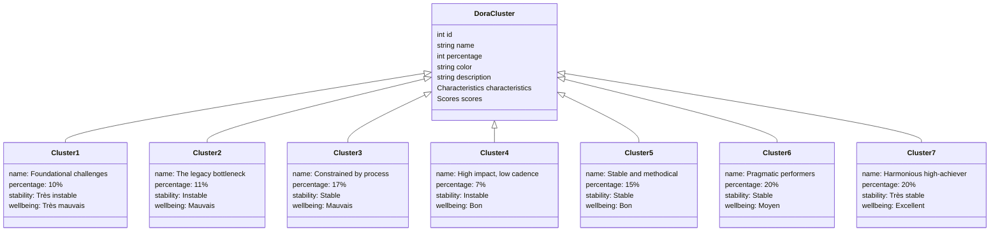
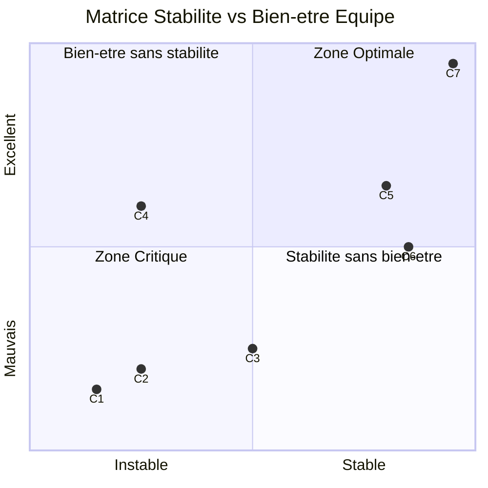
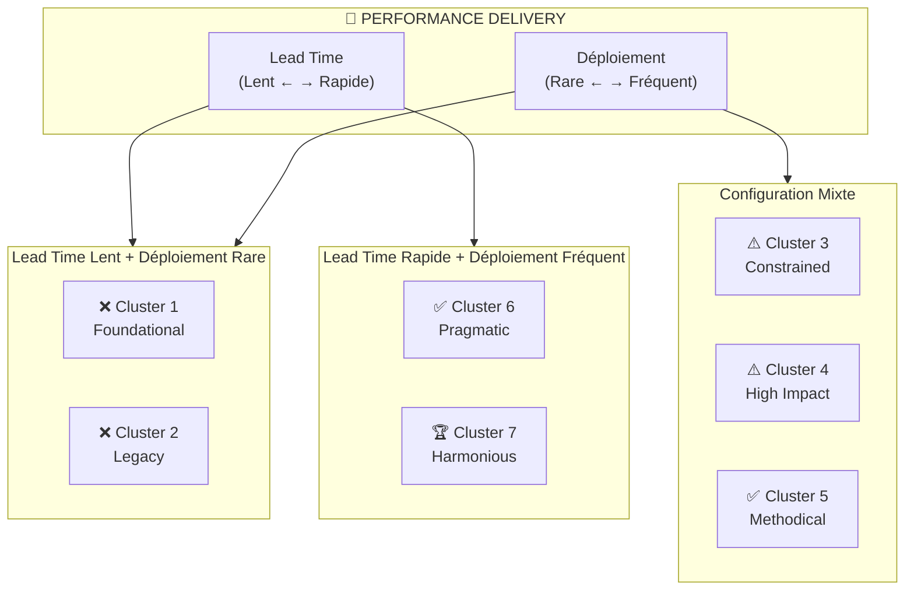
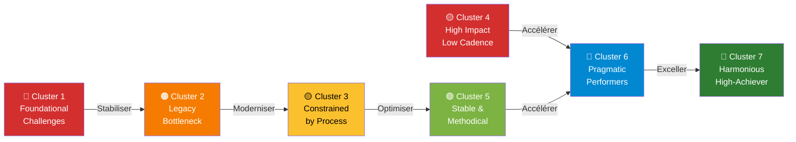

# Matrice de Positionnement DORA - Diagramme de Classe

# Matrice Stabilité vs Bien-être

**Interprétation par Quadrant:**

| Quadrant | Stabilité | Bien-être | Clusters | Statut | Action |
|----------|-----------|-----------|----------|--------|--------|
| **Q3 - Critique** 🔴 | Instable | Mauvais | C1, C2 | URGENT | Stabiliser ET améliorer bien-être |
| **Q2 - Paradoxe** 🟡 | Instable | Bon | C4 | ATTENTION | Stabiliser les systèmes |
| **Q4 - Contrainte** 🟡 | Stable | Mauvais | C3 | ATTENTION | Améliorer bien-être équipe |
| **Q1 - Optimal** 🟢 | Stable | Bon/Excellent | C5, C6, C7 | CIBLE | Maintenir et progresser |

**Détails par Cluster:**
- **C1 (10%)** - Foundational challenges: Instable + Très mauvais bien-être
- **C2 (11%)** - Legacy bottleneck: Instable + Mauvais bien-être  
- **C3 (17%)** - Constrained by process: **Stable + Mauvais bien-être** 🔶
- **C4 (7%)** - High impact, low cadence: **Instable + Bon bien-être** 🔶
- **C5 (15%)** - Stable and methodical: Stable + Bon bien-être
- **C6 (20%)** - Pragmatic performers: Stable + Moyen bien-être
- **C7 (20%)** - Harmonious high-achiever: Très stable + Excellent bien-être

# Matrice Lead Time vs Deployment Frequency

# Trajectoire d'Amélioration

