# Matrice de Positionnement DORA - Diagramme de Classe

# Matrice Stabilité vs Bien-être

**Interprétation par Quadrant:**

| Quadrant | Stabilité | Bien-être | Clusters | Statut | Action |
|----------|-----------|-----------|----------|--------|--------|
| **Q3 - Critique** 🔴 | Instable | Mauvais | C1, C2 | URGENT | Stabiliser ET améliorer bien-être |
| **Q2 - Paradoxe** 🟡 | Instable | Bon | C4 | ATTENTION | Stabiliser les systèmes |
| **Q4 - Contrainte** 🟡 | Stable | Mauvais | C3 | ATTENTION | Améliorer bien-être équipe |
| **Q1 - Optimal** 🟢 | Stable | Bon/Excellent | C5, C6, C7 | CIBLE | Maintenir et progresser |

**Détails par Cluster:**
- **C1 (10%)** - Foundational challenges: Instable + Très mauvais bien-être
- **C2 (11%)** - Legacy bottleneck: Instable + Mauvais bien-être  
- **C3 (17%)** - Constrained by process: **Stable + Mauvais bien-être** 🔶
- **C4 (7%)** - High impact, low cadence: **Instable + Bon bien-être** 🔶
- **C5 (15%)** - Stable and methodical: Stable + Bon bien-être
- **C6 (20%)** - Pragmatic performers: Stable + Moyen bien-être
- **C7 (20%)** - Harmonious high-achiever: Très stable + Excellent bien-être

# Matrice Lead Time vs Deployment Frequency

```mermaid
graph TB
    subgraph Performance["🚀 PERFORMANCE DELIVERY"]
        direction TB
        LT["Lead Time<br/>(Lent ← → Rapide)"]
        DF["Déploiement<br/>(Rare ← → Fréquent)"]
    end
    
    subgraph QuadLT["Lead Time Lent + Déploiement Rare"]
        C1["❌ Cluster 1<br/>Foundational"]
        C2["❌ Cluster 2<br/>Legacy"]
    end
    
    subgraph QuadRT["Lead Time Rapide + Déploiement Fréquent"]
        C6["✅ Cluster 6<br/>Pragmatic"]
        C7["🏆 Cluster 7<br/>Harmonious"]
    end
    
    subgraph QuadMixed["Configuration Mixte"]
        C3["⚠️ Cluster 3<br/>Constrained"]
        C4["⚠️ Cluster 4<br/>High Impact"]
        C5["✅ Cluster 5<br/>Methodical"]
    end
    
    LT --> QuadLT
    LT --> QuadRT
    DF --> QuadLT
    DF --> QuadMixed
```

# Trajectoire d'Amélioration

```mermaid
graph LR
    C1["🔴 Cluster 1<br/>Foundational<br/>Challenges"]
    C2["🟠 Cluster 2<br/>Legacy<br/>Bottleneck"]
    C3["🟡 Cluster 3<br/>Constrained<br/>by Process"]
    C4["🟡 Cluster 4<br/>High Impact<br/>Low Cadence"]
    C5["🟢 Cluster 5<br/>Stable &<br/>Methodical"]
    C6["🔵 Cluster 6<br/>Pragmatic<br/>Performers"]
    C7["💚 Cluster 7<br/>Harmonious<br/>High-Achiever"]
    
    C1 -->|Stabiliser| C2
    C2 -->|Moderniser| C3
    C3 -->|Optimiser| C5
    C4 -->|Accélérer| C6
    C5 -->|Accélérer| C6
    C6 -->|Exceller| C7
    
    style C1 fill:#d32f2f,color:#fff
    style C2 fill:#f57c00,color:#fff
    style C3 fill:#fbc02d,color:#000
    style C4 fill:#d32f2f,color:#fff
    style C5 fill:#7cb342,color:#fff
    style C6 fill:#0288d1,color:#fff
    style C7 fill:#2e7d32,color:#fff
```

